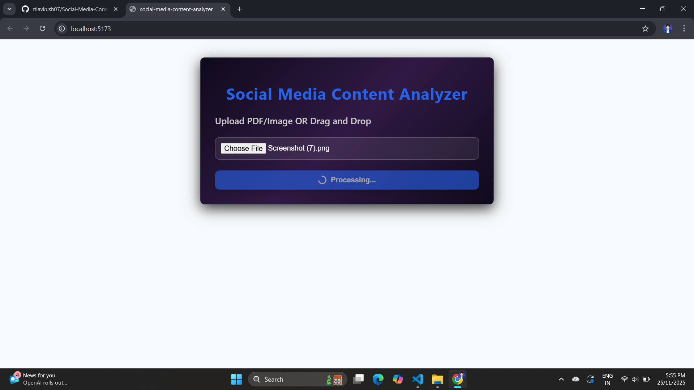
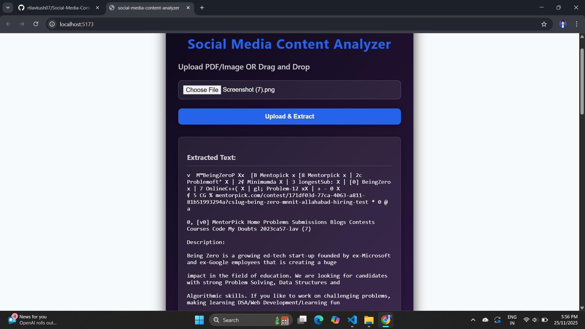
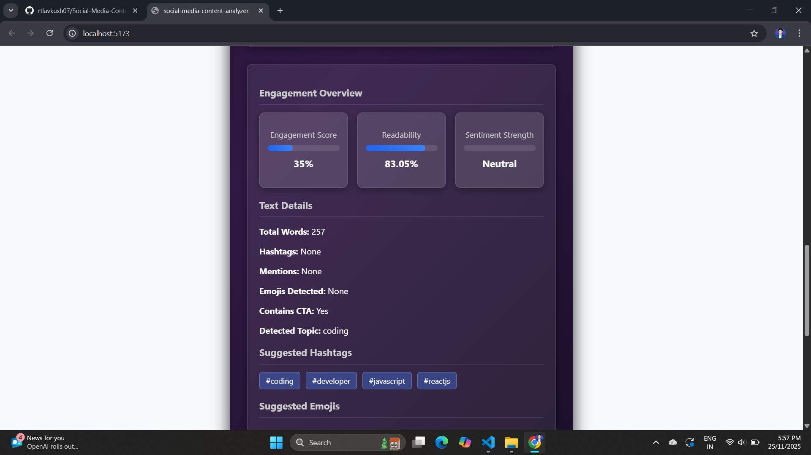
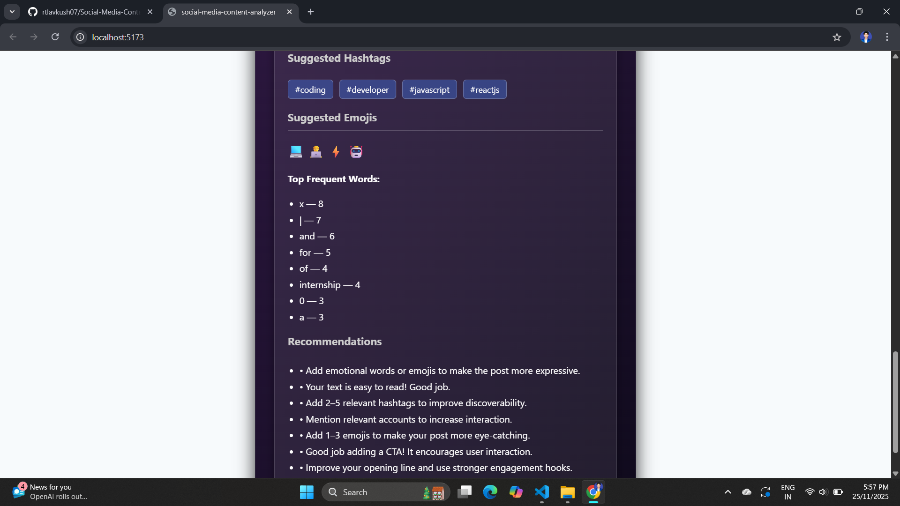

📘 Social Media Content Analyzer

An advanced, production-ready application that extracts text from PDFs and images using OCR & PDF parsing, and performs AI-like content analysis to generate social-media-optimized insights.

🚀 Overview

The Social Media Content Analyzer allows users to upload PDFs or image files and automatically extract all readable text using a hybrid engine of pdfjs-dist and Tesseract OCR.

Once extracted, the content is analyzed for:

Text Readability

Sentiment

Engagement Potential

Keyword Frequency

Topic Detection

Suggested Hashtags

Suggested Emojis

CTA (Call-To-Action) Identification

Smart Recommendations

This tool is ideal for analyzing Instagram captions, Facebook posts, LinkedIn writeups, Twitter posts, scanned notes, and blog snippets.

✨ Key Features
📂 1. File Upload

Upload PDF, JPG, PNG, JPEG, WEBP

Drag & Drop OR manual file selector

Smooth UX with loading spinner

Auto-validation for supported formats

📝 2. Text Extraction (Dual Engine)
PDF Parsing (Selectable PDFs)

✔ Extracts structured text using pdfjs-dist
✔ Maintains line breaks & formatting

OCR Extraction (Scanned PDFs & Images)

Uses Tesseract.js to extract text from:

Scanned PDFs

Handwritten images

JPG / PNG / JPEG

✔ Automatically detects scanned vs normal PDF
✔ Auto-file cleanup after extraction

🧠 3. Advanced Text Analysis (NEW!)
🔹 Sentiment Analysis

Positive / Neutral / Negative + score (−1 → +1)

🔹 Readability Score

0–100 scale with linguistic heuristics

🔹 Engagement Score

Weighted combination of

Text variety

Readability

Sentiment strength

Emojis

Hashtag quality

CTA presence

🔹 Topic Detection (NEW!)

Auto-detects topic such as:

Coding

Fitness

Study

Travel

Food

Business

Fashion

Motivation

🔹 Suggested Hashtags (NEW!)

AI-style suggestions based on detected topic.
Example:
#coding #reactjs #developer #javascript

🔹 Suggested Emojis (NEW!)

Smart emoji suggestions for higher engagement:
Example:
💻⚡🤖 (coding)
💪🔥🏋️ (fitness)

🔹 CTA Detection (NEW!)

Detects phrases like:
"Follow", "Subscribe", "Share", "Comment", "Check out"

🔹 Smart Recommendations (NEW!)

Provides human-grade advice:

Improve opening line

Add emojis

Add hashtags

Tone improvement

CTA suggestions

📊 4. Analytics Dashboard (NEW UI)

Modern responsive UI features:

✔ Score Bars for Engagement, Readability, Sentiment
✔ Metric Cards
✔ Hashtag Chips
✔ Emoji Display
✔ Category Badge
✔ Polished gradient UI
✔ Smooth animations

🛠 Tech Stack
Frontend

React (Vite)

Axios

Custom Gradient CSS

Analytics Dashboard UI

Backend

Node.js + Express

Multer (file uploads)

pdfjs-dist (PDF parser)

Tesseract.js (OCR engine)

fs (file cleanup)

📁 Updated Project Structure
Social-Media-Content-Analyzer/
│
├── server/
│ ├── routes/
│ │ └── upload.js
│ ├── services/
│ │ ├── pdfParser.js
│ │ └── ocr.js
│ ├── server.js
│ └── package.json
│
└── client/
├── src/
│ ├── components/Upload.jsx
│ ├── utils/analysis.js
│ ├── Upload.css
│ └── App.jsx
├── index.html
└── package.json

▶️ How to Run Locally
Backend
cd server
npm install
npm start

👉 Runs at: http://localhost:5000

Frontend
cd client
npm install
npm run dev

👉 Runs at: http://localhost:5173

🔌 API Endpoint
POST /api/upload

Form-Data:

file: <PDF or Image>

Response:

{
"text": "Extracted content here"
}

🧪 Sample Analysis Output
{
"sentiment": "Positive",
"sentimentScore": 0.35,
"readability": 78.52,
"engagementScore": 84,
"totalWords": 154,

"detectedCategory": "coding",
"suggestedHashtags": ["#coding","#developer","#javascript","#reactjs"],
"suggestedEmojis": ["💻","⚡","🤖"],

"topWords": [{ "word": "react", "count": 3 }],
"recommendations": [
"Great tone! Positive posts get more engagement.",
"Add 1–3 emojis to increase appeal."
]
}

📝 Updated 200-Word Approach (NEW FEATURES INCLUDED)

This application implements a hybrid document-processing architecture combining PDF text extraction and OCR scanning for maximum accuracy. Using pdfjs-dist, the system first attempts to extract structured text from any uploaded PDF. If the PDF contains no selectable text, the backend automatically switches to Tesseract.js to perform OCR and extract text from scanned pages or image uploads. All files are removed afterward to maintain a clean and safe server environment.

The extracted text undergoes a multi-stage analysis pipeline. The analyzer computes readability, sentiment score, emoji usage, hashtag count, and overall engagement score. A custom NLP module detects the document’s topic—such as coding, fitness, food, or motivation—based on keyword clustering. The system then generates AI-like recommendations, suggesting hashtags, emojis, CTAs, and text improvements to maximize social media engagement. This includes dynamic hashtag generation based on detected topic and smart emoji suggestions.

On the frontend, the dashboard UI is built with React and includes metric cards, animated score bars, hashtag chips, and smooth-loading interactions. Axios handles backend communication with an Express API. The project follows clean code practices, modular service structure, and strong error handling, making it production-ready and easy to extend.

Live Demo Project : - https://social-media-content-analyzer-26m5.vercel.app/

## Demo of project ( screenshots )

## -------

## -------

## -------

## -------

👤 Author

Lav Kumar
MNNIT Allahabad
